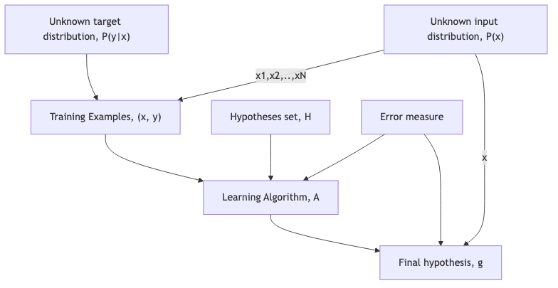

# README

## Overview

The README provides some info on the topic learning from data provided as open learning from Prof. Abu Mostafa of Caltech Univ.

### References
- Caltech course for Learning from Data: https://work.caltech.edu/telecourse.html
- Youtube playlist for Learning from Data: https://www.youtube.com/playlist?list=PLD63A284B7615313A

## Details

### key concepts


- the data set

The data set is generally all relevant input data provided to a learning problem that in most practical cases, is out of the control of the learning system and is provided by an external source and that is used to build a set of training and test data for the chosen learning algorithm / model.


- linearly separable data: 

A simple concept where data is easily separable by a stright line. In most cases, data is not linerarly separable but there are techniques available to transform input data that is not linearly separable to a format that is separable. Applying perceptron algorithm can be used for linearly separable data.


- perceptron model

A very simple model that takes attributes (x) and given different chosen weights (w), adds their products in a linear form (e.g sum of x_i*w_i ) and the data available is linearly separable (has two classes of the data separable by a straight line, e.g movie ratings with positive vs negative rating, credit approval with approved or not approved, etc).

Very good model in terms of generalisation but generally not so good for most practical learning problems - if you can convert a complex learning problem into a more simpler linearly separable data problem then perceptron model may be useful.


$$\left( \sum_{i=1}^d w_i x_i \right)$$

(python sample)
```
import numpy as np

np.sum(w, x)
```

- machine learning

A system for automating process of learning an outcome from a learning problem and an input data set where a pattern exists in the data.

- in-sample error

Probability an item selected in sample set is incorrect

- out-of-sample error

Probability that item selected in data set outside of the sample set is incorrect

- hypotheses set

The hypotheses set is the set of all hypotheses functions ($h_i$) to describe a learning problem to help apply an appropriate chosen hypothesis function (g) to predict some suitable predicted outcome that aligns closely to the target function and can be anything and can be continuous or discrete, finite or infinite (almost all are continuous and infinite) but under one condition, we can generally find if hypotheses set is huge or continuous and if a reasonable (predicted) outcome can be derived using techniques provided.

The hypotheses set is the most important aspect of generalistion such as minimising the error function. The choice of hypotheses may depend on the type of learning problem, data set and business and technical teams involved (e.g baysian based using probablity and prediction vs other)


- optimisation method

The method used for generalising the learning problem such as minimising the error function and an example is the SVM (support vector machine) method.


- perceptron model hypotheses with bias/threshold w0

$$h(x) = sign \left( \sum_{i=1}^d w_i x_i + w0\right) = sign \left( \sum_{i=0}^d w_i x_i\right), (x_0=1)  = sign( W^T * X )$$

$W^T * X$ represents the transpose of weights times input data set X and in python can be represented easily using numpy arrays and numpy functions.


- hoeffding inequality

It is a simple bound that as the sample size N grows, is exponentially unlikely that in-sample error ($E_{in}(h)$ or $\nu$) will deviate from the out-of-sample error ($E_{out}(h)$ or $\mu$) by more than positive tolearnce value $\epsilon$...

$$P[|\nu - \mu| > \epsilon] <= 2e^{-2e^{2}N}$$

This can also be represented as follows:

$$P[|E_{in}(h) - E_{out}(h)| > \epsilon] <= 2e^{-2e^{2}N}$$

Also, in-sample error and out-of-sample error can be expressed as follows: 

$$E_{in}(h) = 1/N \left( \sum_{n=1}^N [ h(X_n) \neq f(X_n) ] \right)$$

$$E_{out}(h) = P[h(x) \neq f(x)]$$


- predicting from multiple hypotheses

The previous heoffding inequality deals with a single hypotheses, h(x) but we will in general have multple hypotheses to choose an optimal function, g(x). We can use the following two rules to represent heofffding inequality for M hypotheses to settle on a single hypotheses g(x) to aproximate the target function f(x) as follows...

1. given an event B1 and B2, if B1 implies B2 then P[B1] <= P[B2]
2. Using the union bound, P[B1 or B2] <= P[B1] + P[B2] 

- generalisation error

With the previous two rules, we can approximate hoeffding inequality for g with the following.

$$P[|E_{in}(g) - E_{out}(g)| > \epsilon] <= 2Me^{-2e^{2}N}$$

M is a measure of complexity of the selected hypotheses function, g(x).

- Error measure

The error measure is a measure of how well the selected hypotheses function, g(x) approximates the target function f(x) and it is expected that there will be some small error but that it should be as small as possible.

$$Error = E(h, f)$$


- generalisation bound

Given a tolerance $\delta$ we can equate out-of-sample error to in-sample error for g(x) as follows...

$$E_{out}(g) <= E_{in}(g) + \sqrt( \frac{1}{2N}ln\frac{2M}{\delta})$$

- general supervised learning problem



## git repo commands

### git repo setup and access

- setup ssh key
```
ssh-keygen -t rsa -b 4096 -C "<add-your-user-email-here>"
```

- after creating and accepting defaults, copy and paste id_rsa.pub contents to your github.com account ssh keys in admin
```
cat ~/.ssh/id_rsa.pub
```

- clone repo (crete first on github.com)
```
git clone git@github.com:<username>/educ-learning-from-data.git
```

- create a new repository on the command line
```
echo "# educ-learning-from-data" >> README.md
git init
git add README.md
git commit -m "first commit"
git branch -M main
git remote add origin git@github.com:alanpmullane/educ-learning-from-data.git
git push -u origin main
```

-  push an existing repository from the command line
```
git remote add origin git@github.com:alanpmullane/educ-learning-from-data.git
git branch -M main
git push -u origin main
```

